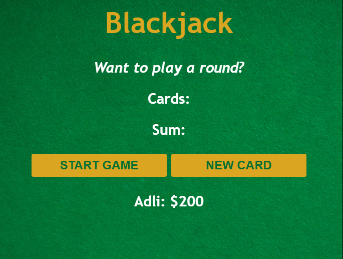
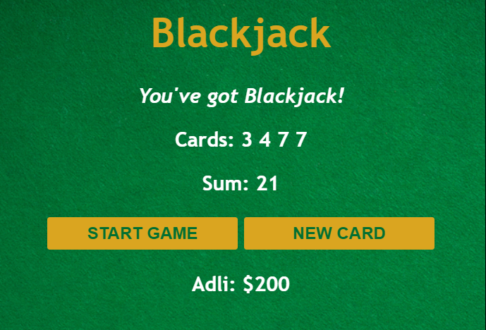

# Simple Blackjack Game
A simple Blackjack game built with HTML, CSS, and JavaScript.

## Project Description
This project is a basic implementation of the popular card game Blackjack. Players can start a game, draw new cards, and see if they can hit 21 to win. The game is built using plain HTML, CSS, and JavaScript, focusing on DOM manipulation to handle the game logic.

## Features
* Start a new Blackjack game.
* Draw additional cards to try to reach 21 without going over.
* Displays current cards and the sum of the cards.
* Simple and clean user interface.

## Installation
To run this project locally, clone the repository and open the index.html file in your web browser.

```bash
git clone https://github.com/Adlichalbi/BlackJack.git
cd blackjack-game
open index.html
```

## Usage
1. Open the index.html file in your web browser.
2. Click the "START GAME" button to begin a new game.
3. Click the "NEW CARD" button to draw another card.
4. Try to get as close to 21 as possible without going over!

## Technologies Used
* HTML: For the game structure.
* CSS: For styling the game interface, including a custom background image and button styles.
* JavaScript: For game logic, including card drawing and score calculation.

## Screenshots



## License
This project is open source and available under the MIT License.

## Contact
If you have any questions or suggestions, feel free to reach out.

